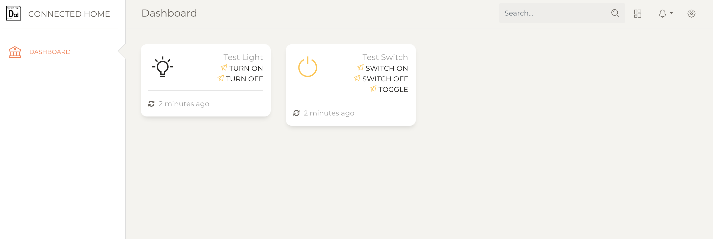

# Connected Home

Connected Home is a teaching environment simulating a connected home. The aim is to enable industrial product designers to experience software-based product development.

The current current release is available here: ...

# Running Connected Home on your machine

The easiest way to run Connected Home on your machine is to use Docker. See how to install Docker [here](https://www.docker.com/products/docker-desktop).

Once Docker is running on your machine, go to Docker settings (Preferences on Mac) > Command Line and "enable experimental features" so that the app feature of Docker is accessible.

In the terminal, run the following command:

```sh
docker app install datacentricdesign/connected-home:0.0.4
```

# What Does it Do

When Connected Home is running, it runs an API in Python, and a web user interface in Angular.

Both are accessible via a web browser.

First, the web UI is accessible locally, on port 4200 ([http://localhost:4200](http://localhost:4200)). It loads a minimal dashboard listing the 'things' available, retrived from the API. By default the server create a light bulb and a switch, the light bulb is OFF and the switch is ON. Their behaviours are not connected.



The services available for each thing are listed. For instance, a light bulb as 'TURN ON' and 'TURN OFF'. Clicking on these buttons triggers the function on the server. For instance, after clicking on 'TURN ON', you can refresh the page and observe the light bulb icon turning yellow.

Second, the API is accessible on port 5000 ([http://localhost:5000/things](http://localhost:5000)). It exposes the functionalities of Connected Home.

In the current version, it can:

- retrieve all things: ([GET /things](http://localhost:5000/things))


- retrieve a thing by id: GET /things/:thingId

- create a thing: POST /things

This time the we cannot use the web browser, as we want to execute a POST request (making a change on the server).

A nice tool to play with REST API is [Postman](https://www.postman.com/). Here is a Postman collection with the APIs of Connected Home: [](https://app.getpostman.com/run-collection/bcc6244b6a2f1f129d9f)

To create a thing, the request must provide a json object as follows, including a name and a type (Switch of Light).

```json
{
  "name": "Thing name",
  "type": "Switch"
}
```

- control a thing: POST /things/:thingId/controls/controlId

## Uninstall

To uninstall the app, run:

```sh
docker app uninstall connected-home
```

# Development

If you're the developer, follow the [installation guide](/Development.md) to make connected-home app up and running!
